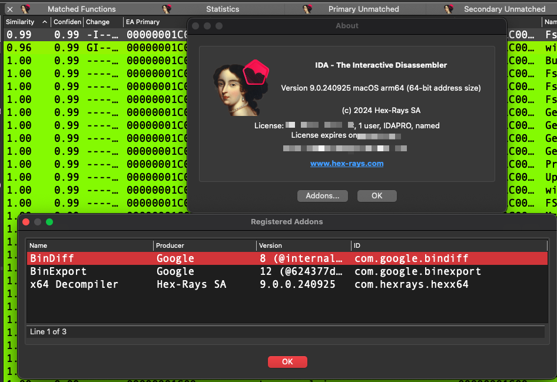

# Bindiff IDA Pro 9.0 Apple Silicon
Bindiff and Binexport dylibs for IDA Pro 9 on Apple Silicon

Add all of these to `~/.idapro/plugins`.

> **NOTE:** When attempting to diff a database, you may recieve an error that `ida64` cannot be found. Simply make a copy of `/Applications/IDA Professional 9.0.app/Contents/MacOS/ida` and name it `ida64`

